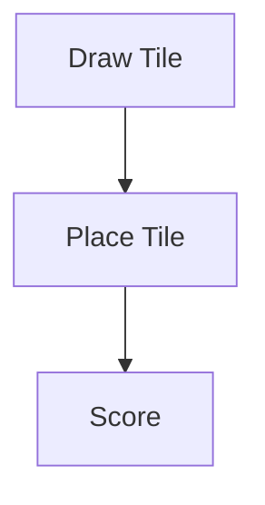

# CLAUDE DEVELOPMENT GUIDELINES

## 0. AUTONOME ENTWICKLUNG — NOTION ALS SINGLE SOURCE OF TRUTH

### Zentrale Projektquelle

Das Notion-Workspace ist die **verbindliche Single Source of Truth** für alle Anforderungen, Aufgaben, Entscheidungen und Projektstände:

**Notion-URL:** `https://www.notion.so/Carcassonne-dfae27f8f8af839c9c1281293e1a5af7`

Jede Implementierung muss auf mindestens einer der folgenden Quellen basieren:

- Arbeitspaket (Carcassonne-Tasks Datenbank)
- Stakeholder-Entscheidung (Meeting-Protokolle)
- Projektdokumentation (Anforderungen und Arbeitspakete)
- Architekturvorgabe (diese Datei + `/specs`)

### Entwicklungsprozess

**Vor Beginn jeder Arbeit:**
1. Analysiere sämtliche offenen und priorisierten Arbeitspakete im Notion-Workspace.
2. Prüfe die Ergebnisse der bisherigen Stakeholder-Meetings.
3. Identifiziere Abhängigkeiten zwischen Arbeitspaketen.
4. Leite daraus die nächsten Entwicklungsschritte ab.

**Während der Entwicklung:**
- Halte dich strikt an die definierten Arbeitspakete.
- Implementiere ausschließlich Funktionen, die durch dokumentierte Anforderungen oder Stakeholder-Entscheidungen begründet sind.
- Dokumentiere technische Entscheidungen nachvollziehbar.
- Stelle sicher, dass Änderungen getestet und funktionsfähig sind.
- Halte Architektur, Codequalität und Dokumentation auf einem professionellen Niveau.

### Arbeitspaket-Management

Für jedes Arbeitspaket:
- Beschreibung analysieren
- Akzeptanzkriterien erfüllen
- Abhängigkeiten berücksichtigen
- Implementierung durchführen
- Tests erstellen oder aktualisieren
- Dokumentation ergänzen

**Status-Workflow:** Offen → In Bearbeitung → Review → Erledigt *(oder: Blockiert)*

**Review-Kriterien:**
- Code-Review durch anderes Teammitglied
- Alle Tests grün
- McCabe-Zahl geprüft (< 15)
- Keine neuen Lint-Fehler

**Nach Abschluss eines Arbeitspakets:**
- Status im Notion aktualisieren
- Zugehörige Commits dokumentieren
- Relevante Notion-Einträge aktualisieren
- Offene Folgeaufgaben identifizieren

### Stakeholder-Meetings

Alle Stakeholder-Meetings sind verbindliche Meilensteine.

| Meeting | Datum | Status |
|---------|-------|--------|
| Stakeholder Meeting #1 | 04.05.2026 | ✅ Abgeschlossen |
| Stakeholder Meeting #2 | 11.05.2026 | ✅ Abgeschlossen |
| Stakeholder Meeting #3 | bis 02.06.2026 | 🔴 Offen |
| Stakeholder Meeting #4 (Pre-Release Demo) | bis 10.06.2026 | 🔴 Offen |

**Vor jedem Stakeholder-Meeting:**
- Prüfe alle seit dem letzten Meeting definierten Aufgaben.
- Stelle sicher, dass umgesetzte Anforderungen dokumentiert sind.
- Erstelle einen aktuellen Projektstatus.
- Dokumentiere offene Punkte und Risiken.
- Lege einen Git-Tag an (z. B. `stakeholder-v1`, `stakeholder-v2-2026-05-11`).

**Nach jedem Stakeholder-Meeting:**
- Analysiere neue Entscheidungen.
- Aktualisiere Arbeitspakete im Notion.
- Passe Prioritäten an.
- Dokumentiere neue Anforderungen.
- Plane die nächste Entwicklungsphase.

### Git-Tags für Stakeholder-Meetings

Für jedes Stakeholder-Meeting existiert ein eindeutig reproduzierbarer Entwicklungsstand:

- `stakeholder-v1` — Stand Meeting #1 (04.05.2026)
- `stakeholder-v2-2026-05-11` — Stand Meeting #2 (11.05.2026)
- `stakeholder-v3-2026-06-01` — Stand Meeting #3 (geplant)
- `stakeholder-v4-2026-06-10` — Stand Meeting #4 (geplant)

Der Tag muss exakt den Entwicklungsstand enthalten, der für das jeweilige Meeting vorgesehen war.

### Synchronisation zwischen Notion und Git

Nach jeder relevanten Änderung:
- Arbeitspaketstatus im Notion aktualisieren
- Commits den Arbeitspaketen zuordnen
- Fortschritt dokumentieren
- Review-Aufgaben kennzeichnen
- Erledigte Aufgaben abschließen

Notion und Git müssen jederzeit einen konsistenten Projektstatus widerspiegeln.

### Umgang mit fehlenden oder widersprüchlichen Informationen

1. Prüfe die vorhandene Dokumentation.
2. Prüfe die Ergebnisse früherer Stakeholder-Meetings.
3. Dokumentiere die Unsicherheit.
4. Triff die konservativste und nachvollziehbarste Entscheidung.
5. Erstelle bei Bedarf ein neues Klärungsthema für das nächste Stakeholder-Meeting.

---

## 1. PROJECT CONTEXT

Implement the full base game of Carcassonne.

**Abgabetermin:** 15.06.2026
**Aktuelle Version:** v0.5.0
**Plattform:** Electron Desktop-App (Windows priorisiert)

Tech Stack:

* Electron
* React + TypeScript
* Vite
* CSS (2.5D effects)
* Core logic = framework-independent TypeScript

### Gewählte Erweiterungen (Stakeholder-Entscheidung 04.05.2026)

1. **Netzwerk-Multiplayer (EW-01)** — WebSocket/LAN, Spielsynchronisation, Hochrisiko
2. **Intelligenter KI-Agent (EW-02)** — Reasoning Model via Claude API, strategische Zugevaluierung

### Aktueller Feature-Status (aus Notion)

| ID | Arbeitspaket | Status |
|----|-------------|--------|
| MH-01 | Kachelplatzierung + Regelvalidierung | ✅ Erledigt |
| MH-02 | Feature-System (Stadt, Straße, Kloster, Feld) | ✅ Erledigt |
| MH-03 | Meeple-System + Punktewertung | ✅ Erledigt |
| MH-04 | Hot-Seat Multiplayer (2–5 Spieler) | ✅ Erledigt |
| MH-05 | Zufallsbasierter KI-Gegner | ✅ Erledigt |
| MH-06 | 2D-GUI als Electron Desktop-App | 🔵 In Bearbeitung |
| MH-07 | Spielende + Endabrechnung | ✅ Erledigt |
| MH-08 | Spielfeld Zoom + Bewegen | 🔵 In Bearbeitung |
| EW-01 | Netzwerk-Multiplayer | ✅ Erledigt (v0.2.0) |
| EW-02 | Intelligenter KI-Agent (Claude API) | 🔴 Offen |

### Abnahmekriterien (v1.0.0)

- [ ] Alle Must-Haves vollständig implementiert und getestet
- [ ] 2 Erweiterungen stabil: Netzwerk-Multiplayer + Intelligenter KI-Agent
- [ ] Testsystem schriftlich dokumentiert
- [ ] E2E-Tests automatisiert lauffähig
- [ ] Electron-App lauffähig auf Windows ohne Abstürze
- [ ] Demo im letzten Stakeholder-Meeting bestanden
- [ ] Dokumentation + Quellcode abgegeben (15.06.2026)
- [ ] Abschlusspräsentation gehalten

---

## 2. ARCHITECTURE (STRICT)

Layers:

1. Core → game logic only
2. Controller → game flow
3. UI (React) → rendering only
4. Electron → app lifecycle

No mixing of concerns.

---

## 3. DOMAIN REQUIREMENTS

Full game rules required:

* feature graphs (city, road, monastery, field)
* meeples + ownership
* mid-game + end-game scoring

Use:
→ incremental feature objects with merge/union logic

### Meeple architecture

- Meeples live on **`Feature.meeples: MeeplePlacement[]`** (not on tiles or top-level GameState).
- `getMeepleTargets(state)` → `SegmentRef[]` — valid segments on the last placed tile only.
- `placeMeeple(state, ref)` mutates `feature.meeples` and `player.meeplesAvailable -= 1`.
- `_resolveScoring()` returns meeples automatically when their feature completes.
- UI: `BoardView` renders targets as 26px circles (`data-testid="meeple-target"`), spread radially around tile center to avoid stacking. `TileView` renders already-placed meeples.
- See `specs/09_meeples.md` for full legality rules and test selector table.

---

## 3b. RUNNING TESTS

```bash
# Unit tests (vitest)
npm test

# Unit tests – watch mode
npm run test:watch

# E2E tests (Playwright – dev server auto-starts)
npm run test:e2e

# E2E headed (debug)
npx playwright test --headed

# View last E2E report
npx playwright show-report
```

---

## 4. DOCUMENTATION RULES

* Use Markdown
* Keep specs modular (`/specs` folder)

### Mermaid (MANDATORY)

Use Mermaid diagrams for:

* flows
* state changes
* architecture

Example:



---

## 5. SPEC STRUCTURE

```text id="lp8o6t"
specs/
architecture.md
domain-model.md
tile-system.md
feature-system.md
scoring.md
game-flow.md
api.md
testing.md
09_meeples.md
10_git-workflow.md
```

---

## 6. GIT WORKFLOW (SHORT)

### Branches

* main → production only (no direct commits)
* develop → integration

### Branch types

* feature/* → develop
* release/* → main + develop
* hotfix/* → main + develop

### Rules

* use semantic versioning (MAJOR.MINOR.PATCH)
* tags only on main (`vX.Y.Z`)
* no builds without tags

### Commits (mandatory)

```
type(scope): description
```

---

## 7. PRIORITIES

Focus on:

* correct feature merging
* correct scoring
* clean data model

Avoid:

* overengineering
* UI complexity

---

## 8. ARBEITSPAKETE (QS & PM)

### Qualitätssicherung

| ID | Arbeitspaket | Priorität | Deadline | Status |
|----|-------------|-----------|----------|--------|
| QS-01 | Testsystem-Dokumentation | Hoch | 20.05.2026 | 🔴 Offen |
| QS-02 | Unit Tests & Integrationstests (Vitest) | Hoch | laufend | 🔵 In Bearbeitung |
| QS-03 | E2E-Testautomatisierung (Playwright + Random AI) | Mittel | 08.06.2026 | 🔴 Offen |
| QS-04 | Code-Metriken (McCabe < 15, LoC, Halstead) | Mittel | 08.06.2026 | 🔴 Offen |

### Projektmanagement

| ID | Arbeitspaket | Datum | Status |
|----|-------------|-------|--------|
| PM-00 | Stakeholder-Meeting 1 | 04.05.2026 | ✅ Erledigt |
| PM-01 | Stakeholder-Meeting 2 | 11.05.2026 | ✅ Erledigt |
| PM-02 | Stakeholder-Meeting 3 | bis 02.06.2026 | 🔴 Offen |
| PM-03 | Stakeholder-Meeting 4 (Pre-Release Demo) | bis 10.06.2026 | 🔴 Offen |
| PM-04 | Abschlusspräsentation | 15.06.2026 | 🔴 Offen |
| PM-05 | Projektdokumentation | 15.06.2026 | 🔵 In Bearbeitung |

### Optionale Arbeitspakete (nur bei Zeitkapazität)

| ID | Arbeitspaket | Aufwand |
|----|-------------|---------|
| OPT-01 | Großer Meeple | Niedrig |
| OPT-02 | 2.5D-Optik / SVG-Tiles | Mittel |
| OPT-03 | Spielerweiterung (Händler, Baumeister, Schweinchen) | Hoch |
| OPT-04 | Android-Version | Sehr hoch |

### Kommunikationsplan

- **4 Stakeholder-Meetings**: 2 ✅ absolviert, 2 ausstehend
- **Berichte**: Präzise, sachlich, wissenschaftlicher Stil
- **Kontakt**: E-Mail jederzeit, kurze Sync-Meetings bevorzugt
