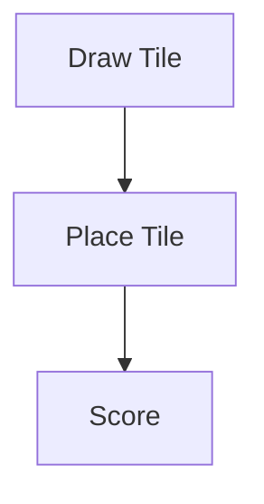

# CLAUDE DEVELOPMENT GUIDELINES

## 1. PROJECT CONTEXT

Implement the full base game of Carcassonne.

Tech Stack:

* Electron
* React + TypeScript
* Vite
* CSS (2.5D effects)
* Core logic = framework-independent TypeScript

---

## 2. ARCHITECTURE (STRICT)

Layers:

1. Core → game logic only
2. Controller → game flow
3. UI (React) → rendering only
4. Electron → app lifecycle

No mixing of concerns.

---

## 3. DOMAIN REQUIREMENTS

Full game rules required:

* feature graphs (city, road, monastery, field)
* meeples + ownership
* mid-game + end-game scoring

Use:
→ incremental feature objects with merge/union logic

### Meeple architecture

- Meeples live on **`Feature.meeples: MeeplePlacement[]`** (not on tiles or top-level GameState).
- `getMeepleTargets(state)` → `SegmentRef[]` — valid segments on the last placed tile only.
- `placeMeeple(state, ref)` mutates `feature.meeples` and `player.meeplesAvailable -= 1`.
- `_resolveScoring()` returns meeples automatically when their feature completes.
- UI: `BoardView` renders targets as 26px circles (`data-testid="meeple-target"`), spread radially around tile center to avoid stacking. `TileView` renders already-placed meeples.
- See `specs/09_meeples.md` for full legality rules and test selector table.

---

## 3b. RUNNING TESTS

```bash
# Unit tests (vitest)
npm test

# Unit tests – watch mode
npm run test:watch

# E2E tests (Playwright – dev server auto-starts)
npm run test:e2e

# E2E headed (debug)
npx playwright test --headed

# View last E2E report
npx playwright show-report
```

---

## 4. DOCUMENTATION RULES

* Use Markdown
* Keep specs modular (`/specs` folder)

### Mermaid (MANDATORY)

Use Mermaid diagrams for:

* flows
* state changes
* architecture

Example:



---

## 5. SPEC STRUCTURE

```text id="lp8o6t"
specs/
architecture.md
domain-model.md
feature-system.md
scoring.md
game-flow.md
api.md
```

---

## 6. GIT WORKFLOW (SHORT)

### Branches

* main → production only (no direct commits)
* develop → integration

### Branch types

* feature/* → develop
* release/* → main + develop
* hotfix/* → main + develop

### Rules

* use semantic versioning (MAJOR.MINOR.PATCH)
* tags only on main (`vX.Y.Z`)
* no builds without tags

### Versioning Strategy

**v1.0.0 = erster finaler Release** — wird erst gesetzt wenn das Projekt vollständig abgeschlossen ist.

Alle Tags **vor v1.0.0** (z. B. `v0.1.0`, `v0.2.0`, …) dienen ausschließlich dazu, den Stakeholdern zwischenstand-fähige Versionen vorzulegen.

#### Selbstevaluation — wann wird ein neuer Tag gesetzt?

Vor jedem Tag selbst prüfen:

| Kriterium | Frage |
|---|---|
| Stakeholder-Präsentation | Gibt es einen neuen Meilenstein, den Stakeholder sehen sollen? |
| Feature-Vollständigkeit | Ist ein in sich geschlossenes Feature-Set stabil und testbar? |
| Qualität | Laufen alle Tests (unit + E2E) durch? Keine bekannten Blocker? |
| Sinnhaftigkeit | Bringt der Tag gegenüber dem letzten echten Mehrwert? |

Wenn **alle** Kriterien erfüllt: `MINOR` erhöhen (z. B. `v0.3.0` → `v0.4.0`).  
Kleine Fixes innerhalb eines Meilensteins: `PATCH` erhöhen (z. B. `v0.3.0` → `v0.3.1`).  
Kein Tag setzen nur wegen Commits — nur bei echtem Mehrwert für Stakeholder.

### Notion-gesteuertes Tagging

Jeder Task in `Carcassonne-Tasks` hat eine optionale Spalte **`Release-Tag`** (Select, z. B. `v0.4.0`).

**Regel:** Sobald **alle** Tasks mit demselben `Release-Tag`-Wert den Status `Erledigt` haben → diesen Git-Tag setzen.

**Workflow:**

1. In Notion prüfen: alle Tasks mit diesem `Release-Tag` = `Erledigt`?
2. Selbstevaluations-Kriterien (Tabelle oben) erfüllt?
3. Release-Branch erstellen, auf `main` mergen, Tag setzen:
   ```bash
   git checkout -b release/vX.Y.Z develop
   git checkout main && git merge release/vX.Y.Z
   git tag vX.Y.Z && git push origin vX.Y.Z
   ```

> Notion ist die einzige Source of Truth für Tagging-Entscheidungen.

### Commits (mandatory)

```
type(scope): description
```

---

## 7. TASK MANAGEMENT (NOTION)

Alle Arbeitspakete und Tasks werden in Notion verwaltet:

* **Seite:** [Carcassonne](https://www.notion.so/3567c6754a298090a159face9651122f)
* **Datenbank:** [Carcassonne-Tasks](https://www.notion.so/3567c6754a29801fb94ced793d3022a6)

### Pflichtregeln

* Tasks werden **ausschließlich aus Notion** bezogen — Notion ist die einzige Source of Truth.
* Bevor du mit einem Task beginnst: aktuellen Status aus Notion lesen.
* Nach jeder Statusänderung **muss der Status in Notion sofort aktualisiert werden**.
* Neue Tasks werden nur in Notion angelegt, nie nur lokal dokumentiert.

### Status-Werte

| Status | Bedeutung |
|---|---|
| Offen | Noch nicht begonnen |
| In Bearbeitung | Aktiv in Arbeit |
| Review | Fertig, wartet auf Prüfung |
| Erledigt | Abgeschlossen |
| Blockiert | Abhängigkeit blockiert Fortschritt |

---

## 8. PRIORITIES

Focus on:

* correct feature merging
* correct scoring
* clean data model

Avoid:

* overengineering
* UI complexity
