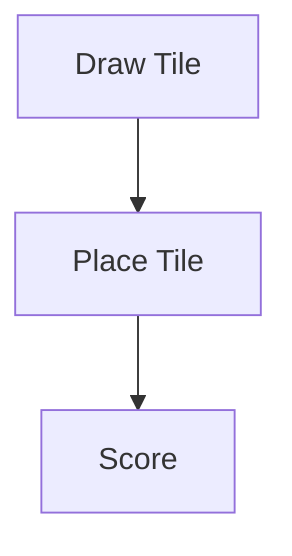

# CLAUDE DEVELOPMENT GUIDELINES

## 1. PROJECT CONTEXT

Implement the full base game of Carcassonne.

Tech Stack:

* Electron
* React + TypeScript
* Vite
* CSS (2.5D effects)
* Core logic = framework-independent TypeScript

---

## 2. ARCHITECTURE (STRICT)

Layers:

1. Core → game logic only
2. Controller → game flow
3. UI (React) → rendering only
4. Electron → app lifecycle

No mixing of concerns.

---

## 3. DOMAIN REQUIREMENTS

Full game rules required:

* feature graphs (city, road, monastery, field)
* meeples + ownership
* mid-game + end-game scoring

Use:
→ incremental feature objects with merge/union logic

### Meeple architecture

- Meeples live on **`Feature.meeples: MeeplePlacement[]`** (not on tiles or top-level GameState).
- `getMeepleTargets(state)` → `SegmentRef[]` — valid segments on the last placed tile only.
- `placeMeeple(state, ref)` mutates `feature.meeples` and `player.meeplesAvailable -= 1`.
- `_resolveScoring()` returns meeples automatically when their feature completes.
- UI: `BoardView` renders targets as 26px circles (`data-testid="meeple-target"`), spread radially around tile center to avoid stacking. `TileView` renders already-placed meeples.
- See `specs/09_meeples.md` for full legality rules and test selector table.

---

## 3b. RUNNING TESTS

```bash
# Unit tests (vitest)
npm test

# Unit tests – watch mode
npm run test:watch

# E2E tests (Playwright – dev server auto-starts)
npm run test:e2e

# E2E headed (debug)
npx playwright test --headed

# View last E2E report
npx playwright show-report
```

---

## 4. DOCUMENTATION RULES

* Use Markdown
* Keep specs modular (`/specs` folder)

### Mermaid (MANDATORY)

Use Mermaid diagrams for:

* flows
* state changes
* architecture

Example:



---

## 5. SPEC STRUCTURE

```text id="lp8o6t"
specs/
architecture.md
domain-model.md
feature-system.md
scoring.md
game-flow.md
api.md
```

---

## 6. GIT WORKFLOW (SHORT)

### Branches

* main → production only (no direct commits)
* develop → integration

### Branch types

* feature/* → develop
* release/* → main + develop
* hotfix/* → main + develop

### Rules

* use semantic versioning (MAJOR.MINOR.PATCH)
* tags only on main (`vX.Y.Z`)
* no builds without tags

### Commits (mandatory)

```
type(scope): description
```

---

## 7. PRIORITIES

Focus on:

* correct feature merging
* correct scoring
* clean data model

Avoid:

* overengineering
* UI complexity
