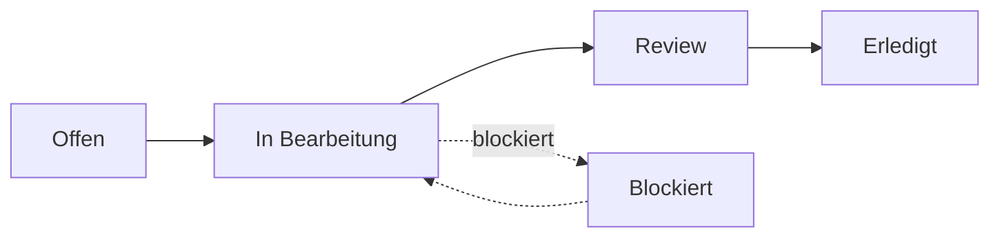
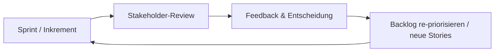
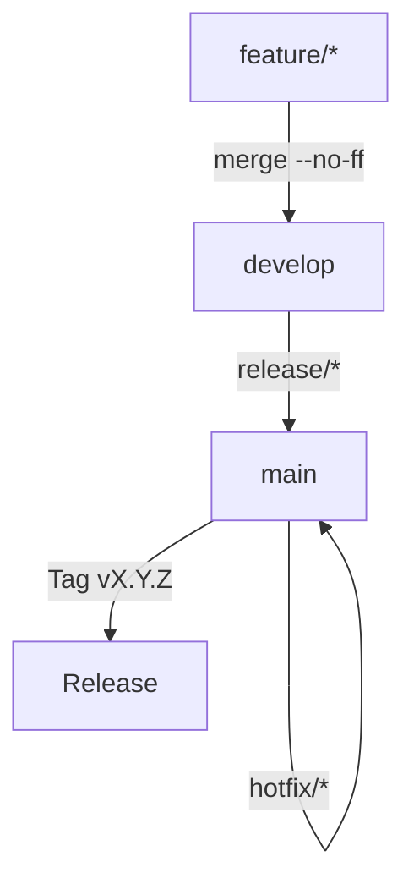

# 01 — Projektmanagement & Vorgehensweise

> Wahl der Vorgehensweise, Stakeholder-Kommunikation, Feedback-Zyklen und der
> Git-/Release-Workflow — **mit Begründungen**.

---

## 1. Wahl der Vorgehensweise: agil (Scrum-orientiert)

### 1.1 Entscheidung

Das Projekt wurde nach einem **agilen, an Scrum angelehnten Vorgehensmodell**
durchgeführt. Die vier Stakeholder-Meetings fungieren als **Sprint-/Inkrement-Reviews**;
jedes Meeting liefert Feedback, das direkt in den Backlog zurückfließt.

### 1.2 Begründung (agil vs. klassisch)

| Kriterium                             | Klassisch (Wasserfall) | **Agil (gewählt)**              |
| ------------------------------------- | ---------------------- | ------------------------------- |
| Anforderungsklarheit zu Beginn        | hoch nötig             | **toleriert Unschärfe**         |
| Stakeholder-Einbindung                | am Anfang/Ende         | **kontinuierlich (4 Reviews)**  |
| Umgang mit Änderungen                 | teuer                  | **eingeplant**                  |
| Risiko-Hochrisiko-Features (Netzwerk) | spät sichtbar          | **früh & iterativ absicherbar** |
| Lieferbare Zwischenstände             | spät                   | **jederzeit demofähig**         |

Ausschlaggebend war, dass (a) die Aufgabenstellung **regelmäßige Stakeholder-Updates
mit lauffähigen Demos** verlangt, (b) bei einem **Hochrisiko-Feature** wie
Netzwerk-Multiplayer iteratives Absichern entscheidend ist, und (c) sich Anforderungen
nachweislich **während des Projekts schärften** (z. B. Zoom/Pan (MH-08) wurde in
Meeting #1 ergänzt; die E2E-Automatisierung (QS-03) dort **gefordert**, aber **erst
kurz vor Meeting #4 umgesetzt** — siehe Feedback-Zyklen unten).

Als **Ersatz für ein klassisches Lasten-/Pflichtenheft** wurde — mit Freigabe des
Stakeholders in Meeting #4 — eine **agile Anforderungsdokumentation** aus *Epics →
User Stories → Tasks* erstellt (siehe [Kapitel 02](02_anforderungen.md)).

---

## 2. Werkzeuge & Organisation

| Zweck                                       | Werkzeug                                   |
| ------------------------------------------- | ------------------------------------------ |
| Backlog / Aufgaben / Single Source of Truth | **Notion** (Datenbank *Carcassonne-Tasks*) |
| Versionsverwaltung                          | **Git / GitHub**                           |
| CI/CD                                       | **GitHub Actions**                         |
| Spezifikationen (technisch)                 | Markdown im Repo (`/specs`)                |
| Kommunikation Stakeholder                   | Stakeholder-Meetings + E-Mail              |

**Backlog-Struktur in Notion** — jedes Arbeitspaket ist ein Datensatz mit den Feldern:
`Kategorie · Priorität · Status · Aufwand (h) · Dauer · Start-/Enddatum · Release-Tag · Blocked-by/Blocking`.

**Status-Workflow** (Kanban):

**Definition of Done** für ein Arbeitspaket:
Akzeptanzkriterien erfüllt · Tests grün · keine neuen Lint-Fehler · **Review durch eine
zweite Person** (Tester ≠ Entwickler, gemäß QS-Vorgaben).

---

## 3. Stakeholder-Meetings (4 von 4)

Die Vorgaben verlangen **mindestens 4 Stakeholder-Updates**. Alle vier wurden
durchgeführt; jedes mit lauffähiger Demo und Statusbericht.

| Meeting                   | Datum       | Kerninhalt / Entscheidung                                                                                                                                                        |
| ------------------------- | ----------- | -------------------------------------------------------------------------------------------------------------------------------------------------------------------------------- |
| **#1 — Kickoff**          | 04.05.2026  | Vorstellung Konzept; **2 Erweiterungen bestätigt** (Netzwerk + KI); **Zoom/Pan (MH-08) und E2E-Automatisierung (QS-03) neu gefordert**; QS-Schwellen fixiert. |
| **#2**                    | 11.05.2026  | GUI-Fortschritt abgenommen; Vertiefung KI & Netzwerk beschlossen; MH-06 priorisiert.                                                                                             |
| **#3**                    | 01.06.2026  | EW-01 als stabil bestätigt; EW-02-Demo; Feature-Freeze geplant; Risiken Netzwerk bewertet; Game-Code-Beitritt (US-M3) und KI-Fallback (US-A3) bestätigt.                 |
| **#4 — Pre-Release Demo** | 15.06.2026 | Abnahme-Demo; **E2E-Automatisierung (QS-03) abgenommen**; **Freigabe der agilen Anforderungsdokumentation** als Pflichtenheft-Äquivalent.                                                                                    |

---

## 4. Feedback-Zyklen (Inkrement → Review → Backlog)

Jedes Meeting ist ein Review-Punkt; das Feedback wird unmittelbar in den Backlog
eingearbeitet:

**Beispiele für stakeholder-getriebene Anforderungen** (entstanden *erst* durch Feedback):

- **US-U2 / MH-08** „Spielfeld zoomen & verschieben" — neu in Meeting #1.
- **US-Q2 / QS-03** „automatisierte Vollpartien (E2E)" — Anforderung in Meeting #1, **Umsetzung kurz vor Meeting #4**.
- **US-M3 / EW-01b** „per Spiel-Code beitreten" — aus Meeting #3.
- **US-A3 / EW-02b** „KI-Fallback ohne API-Key/Timeout" — aus Meeting #3.

---

## 5. Git- & Release-Workflow

### 5.1 Branch-Modell (GitFlow)

| Branch      | Zweck                                           | Regeln                          |
| ----------- | ----------------------------------------------- | ------------------------------- |
| `main`      | nur produktionsreife, getaggte Releases         | geschützt, kein Direkt-Push     |
| `develop`   | Integration des nächsten Releases               | merge-only                      |
| `feature/*` | neue Funktionalität → `develop`                 | keine Tags                      |
| `release/*` | Release-Vorbereitung → `main` + `develop`       | nur Bugfixes/Doku/Versionierung |
| `hotfix/*`  | kritische Produktionsfixes → `main` + `develop` | PATCH-Bump                      |

Vollständige Regeln: `[specs/10_git-workflow.md](../specs/10_git-workflow.md)`.

### 5.2 Conventional Commits & SemVer

Commit-Format: `type(scope): description` (z. B. `feat(ai): add MCP tool-use`).
Versionsableitung: `feat` → MINOR, `fix`/`perf` → PATCH, Breaking Change → MAJOR.
**Tags ausschließlich auf `main`** und nur als annotierte semantische Tags (`vX.Y.Z`).

### 5.3 Versionierung & realer Release-Stand

`v1.0.0` war als *erster finaler Release* definiert; im Projektverlauf wurden iterative
Dev-Tags (`v0.1.0`–`v0.6.0`) sowie Stakeholder-Tags (`stakeholder-v3-2026-06-01`)
zur **internen Meilenstein-Steuerung** verwendet.

> **Realitätsabgleich (verbindlich):** Der für die Abgabe maßgebliche, öffentlich
> getaggte Release ist **`v1.0.0`** (Git-Tag auf `main` + GitHub Release, 22.06.2026),
> ergänzt um das Live-Deployment auf
> [carcassonne.spelk.de](https://carcassonne.spelk.de). Die übrigen in Meetings/Backlog
> genannten Versionen dienten der internen Planung.

---

## 6. Rollout

- **CI/CD** (GitHub Actions): Szenario-/E2E-Tests als Merge-Gate, Desktop-Builds,
automatisches Deployment.
- **Web-Deployment** auf einem VPS (PM2 + rsync + SSH) → carcassonne.spelk.de.
- **Desktop-Pakete** via `electron-builder` (z. B. macOS `.dmg`).
- **Abschlusspräsentation** am 22.06.2026.

Details siehe [Kapitel 06 §5 (CI/CD)](06_qualitaetssicherung.md) und
[Kapitel 07 (Start/Build)](07_installation-start.md).

---

## 7. Umgang mit Unsicherheiten & Risiken

Bei fehlenden/widersprüchlichen Informationen galt die Regel: vorhandene Doku prüfen →
frühere Stakeholder-Ergebnisse prüfen → Unsicherheit dokumentieren → **konservativste,
nachvollziehbarste Entscheidung** treffen → ggf. Klärungspunkt fürs nächste Meeting.

| Risiko                             | Bewertung | Mitigation                                                                                                                |
| ---------------------------------- | --------- | ------------------------------------------------------------------------------------------------------------------------- |
| Netzwerk-Multiplayer (Hochrisiko)  | hoch      | Iterative Absicherung; Wechsel von P2P-WebSocket zu **autoritativem Client-Server**; Reconnect/Hot-Seat-Fallback (US-M4). |
| KI-Verfügbarkeit (API-Key/Timeout) | mittel    | **Heuristik-Fallback** (EW-02b) ohne Absturz.                                                                             |

---

Weiter mit **[Kapitel 02 — Anforderungen (agiles Pflichtenheft)](02_anforderungen.md)**