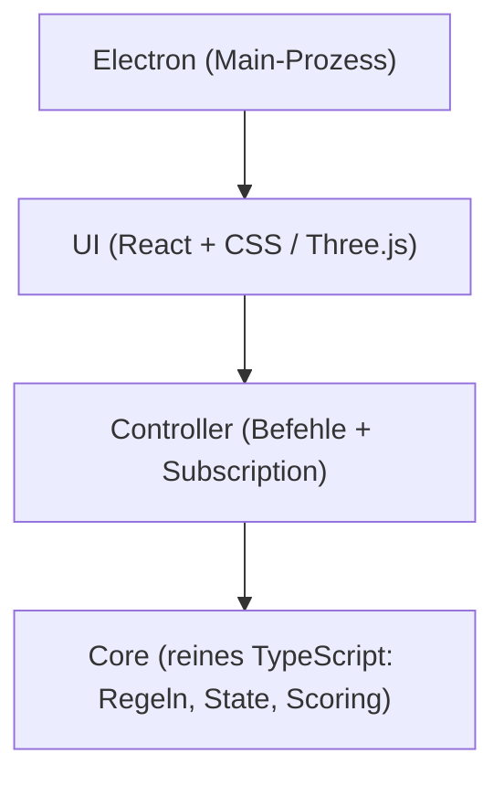
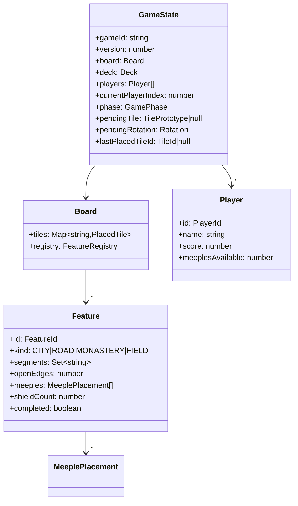
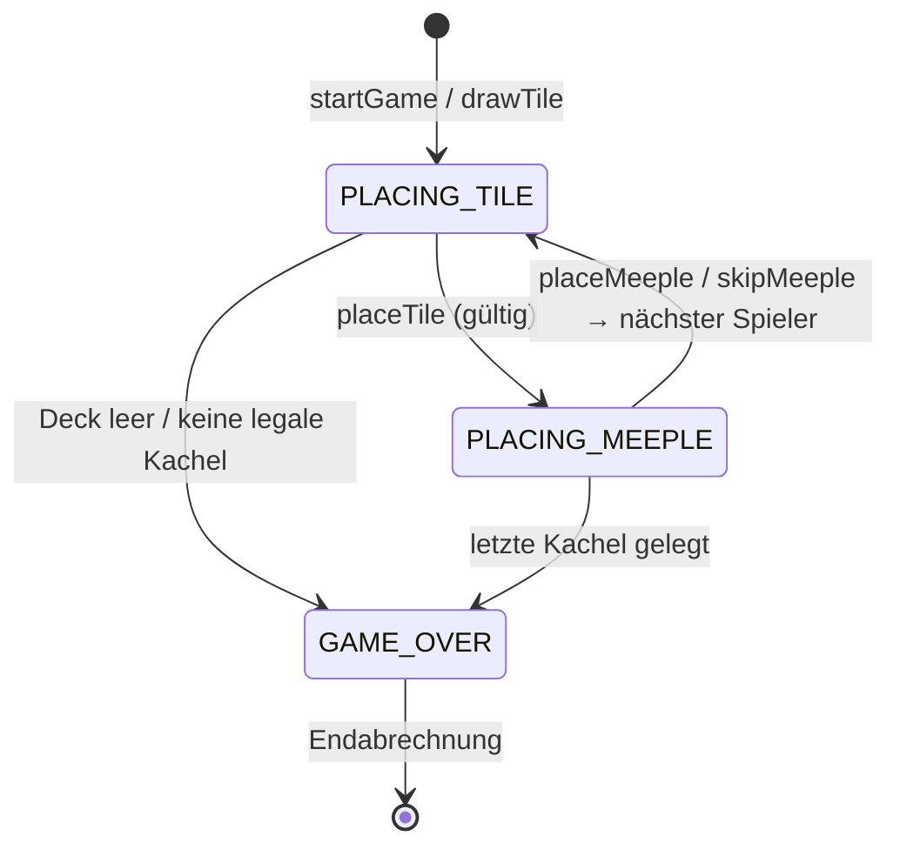
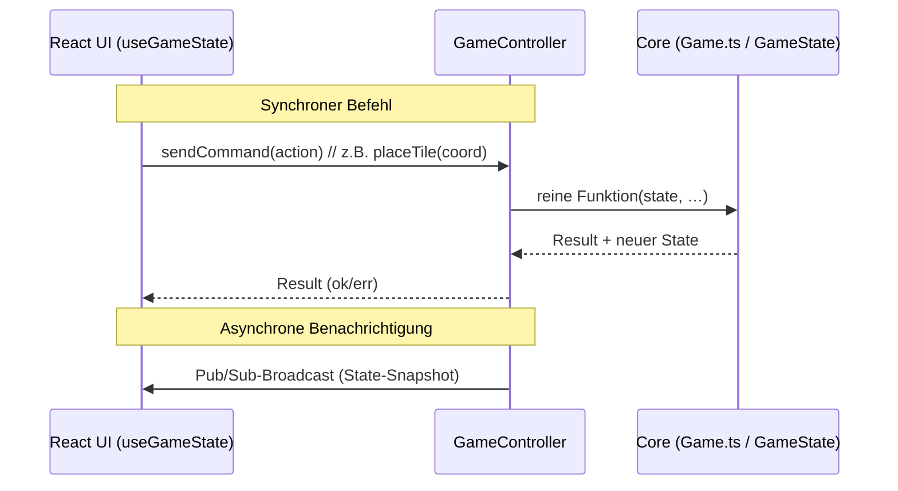

# 03 — Architektur & Design

> Strukturierter Entwurf des Systems: Schichtenarchitektur, Domänenmodell, zentrale
> Design-Entscheidungen — **mit Begründungen** und UML-/Mermaid-Diagrammen.

Technische Vertiefung: [`specs/01_architecture.md`](../specs/01_architecture.md),
[`specs/02_domain-model.md`](../specs/02_domain-model.md),
[`specs/04_feature-system.md`](../specs/04_feature-system.md).

---

## 1. Architektur-Leitprinzip: strikte Schichtung

Das System ist in **vier strikt gestapelte Schichten** gegliedert. Jede Schicht darf
**nur von darunterliegenden Schichten** importieren — keine Vermischung der Belange.



| Schicht | Darf importieren | Darf **nicht** importieren |
|---------|------------------|----------------------------|
| `core/` | nur Standardbibliothek | controller, ui, electron, ai, React, DOM |
| `controller/` | `core/` | ui, electron |
| `ui/` | `controller/`, `core/`-Typen | electron direkt |
| `ai/` | `core/`-Typen | controller, ui |
| `electron/` | nichts aus `src/` zur Laufzeit | — |

**Begründung:** Der Spielkern bleibt damit **framework-unabhängig** und vollständig
**testbar ohne Browser/DOM**. UI-Wechsel (2D ↔ 3D, Web ↔ Desktop) berühren die Spiellogik
nicht. Durchgesetzt wird die Regel über TypeScript-Pfad-Aliase und eine ESLint-Regel
(`import/no-restricted-paths`).

---

## 2. Modulübersicht (Ist-Stand)

```
src/
  core/                 ← reine Spiellogik (framework-frei)
    types.ts            ← Primitive: Terrain, EdgeSide, Rotation, Result, IDs …
    tile/               ← Kachel-Definition, Rotation
    deck/               ← 72-Kachel-Verteilung, Mischen, Ziehen
    board/              ← Platzierung (canPlace/placeTile), Nachbarschaft
    feature/            ← Feature-Records, Segment→Feature-Index, merge, completion
    scoring/            ← midGame, endGame, farmers (Wiesen), majority (Mehrheit)
    game/               ← Game.ts (Aggregat), GameState, Phasen-FSM
    serialize.ts        ← Persistenz (Save/Load)
  controller/
    GameController.ts   ← synchrone Befehle + Pub/Sub-Subscription
    NetworkController.ts← Netzwerk-Variante (EW-01)
    pubsub.ts           ← winziges In-Process-Pub/Sub
  ai/
    index.ts            ← executeAITurn(): orchestriert einen KI-Zug
    random.ts           ← Zufalls-KI (MH-05)
    heuristic.ts        ← Heuristik-/Greedy-KI (EW-02b, Fallback)
    intelligent.ts      ← LLM-Agent (EW-02) via MCP-Tool-Use
  three/                ← 3D-Rendering & prozedurale Kachelgenerierung (OPT-05/06)
  ui/                   ← React-Komponenten (Board, HUD, Setup, Lobby)
server/
  app.ts                ← Express-REST-API
  index.ts              ← HTTP + WebSocket-Server (Port 3001)
  mcp-ai.ts             ← MCP-AI-Analyse-Server (Port 3002)
  gameService.ts        ← serverseitige Spiel-/Session-Logik
  store/                ← Persistenz (Memory / Blob)
electron/
  main.ts               ← BrowserWindow, lädt die (Web-)App
specs/                  ← technische Spezifikationen
tests/, e2e/            ← Vitest- bzw. Playwright-Tests
```

---

## 3. Domänenmodell (Kern-Datenstruktur)

Das Spiel ist als **ein zentraler `GameState`** modelliert, der durch reine Funktionen
fortgeschrieben wird (statt verteilter Mutationen). Vereinfachtes Klassen-/Datenmodell:



**Wichtige Design-Entscheidung — Meeples leben am Feature:** Meeples werden **nicht** an
Kacheln oder im globalen State gehalten, sondern auf `Feature.meeples`. So ist „wem gehört
ein Gebiet" und „ist es belegt" eine *lokale* Eigenschaft des Features — entscheidend für
korrektes **Merging** und die **Mehrheitswertung** (siehe [Kapitel 05 §3](05_implementierung.md)).

---

## 4. Spielablauf als Zustandsautomat (FSM)

Ein Spielzug durchläuft feste Phasen (`GamePhase`). Der Controller erlaubt nur Befehle,
die zur aktuellen Phase passen — so sind **nur regelkonforme Züge** möglich (MH-01).



---

## 5. Datenfluss UI ↔ Controller ↔ Core



Die UI liest den Core-Zustand **nie direkt**, sondern ausschließlich über den
Snapshot des Controllers. Das hält die Belange sauber getrennt und ermöglicht es,
dieselbe Logik lokal *und* über das Netzwerk (`NetworkController`) zu betreiben.

---

## 6. Zentrale Design-Entscheidungen (mit Begründung)

| Entscheidung | Alternative | Begründung |
|--------------|-------------|------------|
| **Reiner, framework-freier Core** | Logik in React-Komponenten | Testbarkeit ohne DOM; Wiederverwendung in Web/Desktop/Server/KI. |
| **Reine Funktionen `(state, …) → Result`** | OOP-Objekte mit verstreuter Mutation | Deterministisch, leicht zu testen, einfache Serialisierung/Persistenz. |
| **Feature-Graph mit Union/Merge** | Neuberechnung des ganzen Bretts pro Zug | Inkrementell & effizient; Gebiete wachsen/verschmelzen lokal. |
| **Meeples am `Feature`** | Meeples an Kachel/GameState | Belegung & Eigentum sind Feature-lokal → korrektes Merging/Scoring. |
| **Controller mit Pub/Sub** | UI pollt Core | Entkopplung; UI reagiert auf Events; netzwerktauglich. |
| **Client-Server-Multiplayer** | P2P-WebSocket (Peer-to-Peer) | Autoritatives Backend = einfachere Synchronisation, weniger Cheating. |
| **KI über MCP-Tool-Use** | Prompt mit rohem Board-Dump | Strukturierte Analyse-Tools → bessere & nachvollziehbare KI-Züge; lokaler Fallback. |
| **Datengesteuerte Kacheln** | Hartkodierte Kachellogik | Wartbarkeit/Erweiterbarkeit (Vorgaben §3): Verteilung als Daten (JSON/Prototypen). |

---

## 7. Tech-Stack (Begründung pro Wahl)

| Belang | Wahl | Begründung |
|--------|------|------------|
| Sprache | **TypeScript (strict)** | Statische Typen für ein regelschweres Domänenmodell. |
| UI-Build | **Vite** | Schneller Dev-Server, HMR, schlanke Builds. |
| UI-Framework | **React 19** | Komponenten + Hooks; deklaratives Rendern des Snapshots. |
| 3D | **Three.js / React-Three-Fiber** | Echtes 3D-Board (OPT-05/06) statt CSS-2.5D. |
| Desktop | **Electron + electron-builder** | macOS-Pakete aus einer Web-Codebasis. |
| Backend | **Node + Express + ws** | REST + WebSocket für autoritativen Multiplayer (EW-01). |
| Tests | **Vitest + Playwright** | Unit/Integration + echte Browser-E2E/Szenarien. |
| KI | **OpenAI-kompatibles LLM + MCP** | Reasoning AI; flexibel (OpenRouter/Custom-Endpunkt), Tool-Use, Fallback. |
| CI | **GitHub Actions** | Test-Gate, Builds, Deploy. |

---

Weiter mit **[Kapitel 04 — User Interface](04_user-interface.md)**
