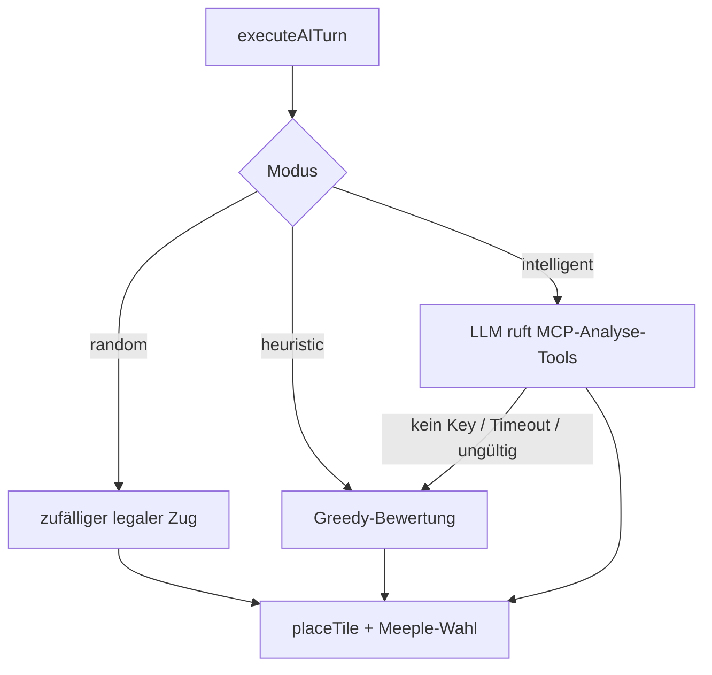

# 05 — Implementierung

> Wie die Anforderungen technisch umgesetzt sind: Spielkern, Wertung, KI und
> Netzwerk-Multiplayer — mit den jeweils relevanten Code-Stellen.

Technische Specs: [`specs/03_tile-system.md`](../specs/03_tile-system.md),
[`specs/04_feature-system.md`](../specs/04_feature-system.md),
[`specs/05_scoring.md`](../specs/05_scoring.md),
[`specs/06_game-flow.md`](../specs/06_game-flow.md),
[`specs/07_api.md`](../specs/07_api.md), [`specs/09_meeples.md`](../specs/09_meeples.md).

---

## 1. Spielkern (`src/core/`) — MH-01/02/03/07

Der Kern ist **framework-frei** und besteht im Wesentlichen aus reinen Funktionen, die
einen `GameState` lesen und einen neuen Zustand bzw. ein `Result` zurückgeben.

### 1.1 Kacheln & Deck (MH-01, US-C5)

- **`core/tile/`** — definiert eine Kachel über ihre vier Kanten (N/O/S/W) und Segmente;
  `rotation.ts` dreht Kanten/Segmente um 0/90/180/270°.
- **`core/deck/`** — die **kanonische 72-Kachel-Verteilung** des Basisspiels ist
  **datengesteuert** (`baseGameTiles.ts`, `tileDistribution.json`, `tiles/tile-A…X.ts`),
  nicht hartkodiert (Wartbarkeit/Vorgaben §3). `shuffle()` mischt, `drawPlaceable()` zieht
  und überspringt nicht platzierbare Kacheln.

### 1.2 Platzierung & Regelvalidierung (MH-01, US-C1)

`core/board/placement.ts`:
- **`canPlace(board, tile, coord, rotation)`** — prüft: mindestens ein platzierter Nachbar
  **und** Kantenübereinstimmung an allen Berührungskanten. Nur legale Züge werden zugelassen.
- **`placeTileInternal(...)`** — legt die Kachel und stößt das Feature-Merging an.

### 1.3 Feature-System: Merge/Union (MH-02, US-C2)

`core/feature/` modelliert Gebiete als **`Feature`-Records** (`CITY|ROAD|MONASTERY|FIELD`)
mit `segments`, `openEdges`, `meeples`, `shieldCount`, `completed`. Beim Platzieren werden
benachbarte Segmente per **Union-Find-Semantik** zu einem Feature verschmolzen
(`merge.ts`); `completion.ts` erkennt **neu fertiggestellte** Gebiete (z. B. geschlossene
Stadt, Straße mit zwei Enden, Kloster mit 8 Nachbarn).

### 1.4 Spiel-Aggregat & Phasen (MH-07)

`core/game/Game.ts` exportiert die **öffentlichen Operationen** als reine Funktionen —
genau jene, die der Controller dünn umhüllt:

```ts
startGame(playerNames, rng?, deckOverride?) → GameState
drawTile(state)            → Result
rotatePending(state, dir)  → Result
placeTile(state, coord)    → Result
placeMeeple(state, ref)    → Result
skipMeeple(state)          → Result
getMeepleTargets(state)    → SegmentRef[]
endGame(state)             → Result
```

Der `deckOverride`-Parameter erlaubt **deterministische Tests/Szenarien** (feste
Kachelreihenfolge ohne Mischen).

---

## 2. Meeple-System (MH-03, US-C3)

- Meeples liegen auf **`Feature.meeples: MeeplePlacement[]`** (nicht an Kachel/State).
- `getMeepleTargets(state)` liefert legale Segmente **nur auf der zuletzt gelegten Kachel**.
- `placeMeeple` reduziert `player.meeplesAvailable` und bindet den Meeple ans Feature.
- Bei **Fertigstellung** eines Features werden die Meeples automatisch **zurückgegeben**.

Legalitätsregeln & Test-Selektoren: [`specs/09_meeples.md`](../specs/09_meeples.md).

---

## 3. Wertung (`src/core/scoring/`) — MH-03/07

| Modul | Wertung |
|-------|---------|
| `midGame.ts` | Sofortwertung bei Fertigstellung: Straße = 1/Kachel, Stadt = 2×(Kacheln+Wappen), Kloster = 9. |
| `endGame.ts` | Unvollständige Gebiete am Spielende: Stadt = 1/Kachel (+1/Wappen), Kloster = 1+Nachbarn. |
| `farmers.ts` | **Wiesen-/Bauernwertung** (Endspiel): 3 Punkte je angrenzender *fertiger* Stadt. |
| `majority.ts` | **Mehrheitsregel**: meiste Meeples auf einem Gebiet erhalten die Punkte; bei Gleichstand **alle** beteiligten Spieler die volle Punktzahl. |

Die Wiesenwertung ist regeltechnisch der anspruchsvollste Teil und wird durch eigene
Unit-Tests und ein End-Game-Szenario abgesichert (siehe [Kapitel 06](06_qualitaetssicherung.md)).

---

## 4. Controller (`src/controller/`)

`GameController.ts` ist eine **dünne, synchrone Fassade** über dem Core:

- Befehle (`startGame`, `drawTile`, `rotatePending`, `placeTile`, `placeMeeple`,
  `skipMeeple`, `endGame`) geben ein `Result` zurück.
- `getState()` liefert einen **schreibgeschützten Snapshot**; `subscribe()` meldet
  Zustandsänderungen per **Pub/Sub** an die UI.
- `previewPlacement(coord, rotation)` und `getMeepleTargetsForLastTile()` versorgen die
  Geister-Vorschau bzw. die Meeple-Auswahl.

`NetworkController.ts` implementiert dieselbe Schnittstelle gegen den **Server**, sodass
die UI lokal *und* online identisch funktioniert.

---

## 5. KI-Gegner (`src/ai/`) — MH-05, EW-02/02b

Ein KI-Zug wird zentral von **`executeAITurn(controller, mode, onStatus?, model?)`**
orchestriert (`ai/index.ts`). Es gibt drei Stufen:

| Modus | Datei | Beschreibung |
|-------|-------|--------------|
| **Zufall** (MH-05) | `random.ts` | Wählt zufällig aus allen legalen Zügen. Treiber der E2E-Vollpartien. |
| **Heuristik** (EW-02b) | `heuristic.ts` | Regelbasierte Bewertung (Greedy); **kein API-Key nötig**; zugleich Fallback. |
| **Intelligent / Reasoning AI** (EW-02) | `intelligent.ts` | **LLM-Agent** (OpenAI-kompatibel, z. B. OpenRouter/Custom-Endpunkt) mit **Tool-Use** über den MCP-Server. |



**Intelligenter Agent (EW-02):** Das LLM bekommt nicht das rohe Brett, sondern ruft über
den **MCP-Server** (Port 3002) gezielte Analyse-Tools auf:

| MCP-Tool | Liefert |
|----------|---------|
| `list_legal_moves` | alle gültigen Platzierungen der aktuellen Kachel |
| `get_board_features` | Städte/Straßen/Klöster inkl. Meeple-Eigentum |
| `get_player_status` | Punkte, Meeple-Vorräte, verbleibende Kacheln |

**Robustheit (US-A3):** Fehlt ein API-Key oder läuft die Anfrage in einen Timeout / liefert
einen ungültigen Zug, fällt der Agent **automatisch auf die Heuristik** zurück — **kein
Absturz**. Der MCP-Server ist optional; ohne ihn führt der Agent dieselben Tools lokal aus.

---

## 6. Netzwerk-Multiplayer (EW-01/01b) — `server/`

Umgesetzt als **autoritatives Client-Server-Modell** (statt P2P):

- **REST-API** (`server/app.ts`, Express): Spiel erstellen/beitreten, Lobby/State abfragen,
  Aktion ausführen.
- **WebSocket** (`server/index.ts`, Port 3001): Echtzeit-Broadcast von Lobby- und
  State-Updates an alle Mitspieler eines Raums.
- **Polling-Fallback**: `GET /api/games/:id/state` für Umgebungen ohne WebSocket.
- **Persistenz** (`server/store/`): Sessions & Spielzustand werden serverseitig gehalten
  (Memory-/Blob-Store) — Grundlage für **Beitritt per Spiel-Code** (US-M3) und
  **Reconnect** (US-M4).

| Endpoint | Zweck |
|----------|-------|
| `POST /api/games` | neues Spiel anlegen (gibt Spiel-Code/Session zurück) |
| `POST /api/games/:id/join` | beitreten |
| `GET /api/games/:id` | Spiel-Info |
| `GET /api/games/:id/lobby` · `/state` | Lobby-/State-Polling |
| `POST /api/games/:id/action` | Spielzug senden |

Der Server validiert jede Aktion über **denselben Core**, den auch der Client nutzt — eine
einzige, gemeinsame Regel-Implementierung (kein Logik-Duplikat).

---

## 7. Persistenz / Session (MH-09)

- **Lokal:** `core/serialize.ts` serialisiert den `GameState`; `App.tsx` speichert lokale
  Partien (inkl. Zug-Log) im `localStorage` und nimmt sie beim Neustart wieder auf.
- **Online:** serverseitige Session-/Spielzustands-Persistenz (siehe §6).

---

Weiter mit **[Kapitel 06 — Qualitätssicherung](06_qualitaetssicherung.md)**
