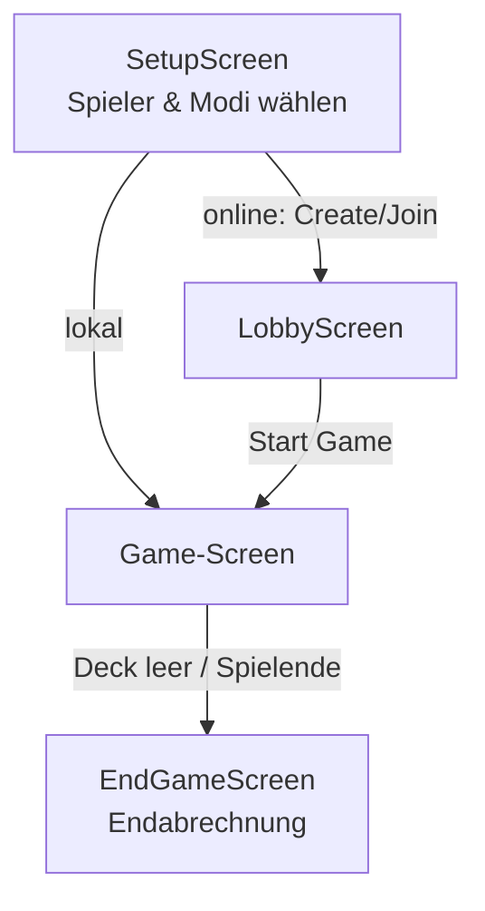
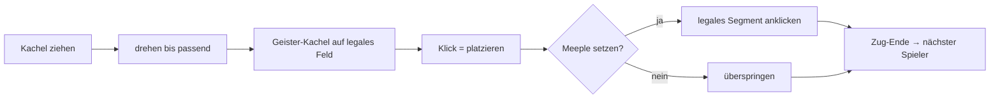

# 05 — User Interface

> Gestaltung der Bedienoberfläche: UI-Konzept, Bildschirme, 2D-/3D-Board und Bedienung —
> mit Begründungen.

---

## 5.1. UI-Leitprinzipien

- **Reines Präsentations-Layer:** Die UI enthält **keine Spiellogik**. Sie rendert den
  vom Controller gelieferten `GameState`-Snapshot und schickt Befehle zurück
  (siehe [Kapitel 04 §4.5](04_architektur-design.md)).
- **Eine Codebasis, mehrere Ziele:** Dieselben React-Komponenten laufen im Browser
  (Web-App) und in Electron (Desktop) — und responsiv auf **Touch-Geräten** (OPT-08).
- **Regelkonformität sichtbar machen:** Ungültige Platzierungen werden gar nicht erst
  angeboten; nur legale Zielfelder/Meeple-Plätze sind anklickbar.

---

## 5.2. Bildschirme & Bedienfluss

| Bildschirm | Datei | Funktion |
|-----------|-------|----------|
| **Setup** | `src/ui/SetupScreen.tsx` | 2–5 Spieler anlegen; pro Spieler Modus wählen (Mensch / Zufall / Heuristik / Reasoning AI); KI-Modell wählen. |
| **Lobby** | `src/ui/LobbyScreen.tsx` | Online-Spiel erstellen/beitreten via 5-stelligem Spiel-Code (EW-01b). |
| **Game** | `src/App.tsx` + Board/HUD | Eigentliches Spiel: Board + Bedienleisten. |
| **End-Game** | `src/ui/hud/EndGameScreen.tsx` | Endabrechnung, Sieger, Punkteaufschlüsselung. |
| **Showcase** | `src/ui/GameShowcase.tsx` | Animierte Start-/Präsentationsansicht (OPT-07). |

---

## 5.3. Aufbau des Game-Screens (HUD)

| Element | Komponente | Zweck |
|---------|-----------|-------|
| Spielbrett 2D | `ui/board/BoardView.tsx` | Kacheln, Geister-Vorschau, Meeple-Ziele. |
| Spielbrett 3D | `ui/board/Board3DView.tsx` | 3D-Ansicht (Three.js/R3F), umschaltbar. |
| Spielerpanel | `ui/hud/PlayerPanel.tsx` | Aktiver Spieler, Punktestände, Meeple-Vorrat (US-U3). |
| Kachelvorschau | `ui/hud/TilePreview.tsx` | Gezogene Kachel + Drehbuttons. |
| Steuerung | `ui/hud/Controls.tsx` | Meeple überspringen, Zug beenden. |
| Meeple-Auswahl | `ui/hud/MeepleChoiceList.tsx` | Auswahl des zu beanspruchenden Gebiets. |
| Zug-Timeline | `ui/hud/TurnTimeline.tsx` | Verlauf der Züge. |
| KI-Status | `ui/hud/AIStatusPanel.tsx` | Live-Anzeige der KI-Überlegung (Tool-Calls, Reasoning, Fallback). |

---

## 5.4. Kacheln platzieren & Meeples setzen (Interaktion)

- **Legale Vorschau:** Beim Hover zeigt eine *Geister-Kachel* (`GhostTile`) an, ob die
  Position gültig ist; der Controller liefert die Legalität über `previewPlacement`.
- **Meeple-Ziele** werden als anklickbare Kreise auf den Segmenten der zuletzt gelegten
  Kachel dargestellt (radial verteilt, um Überdeckung zu vermeiden).
- **Touch/Mobile (OPT-08):** Drag-to-place und Touch-Gesten für Zoom/Pan.

---

## 5.5. Zoom & Pan (MH-08)

Das Spielfeld lässt sich **zoomen und verschieben**, um auch große Partien zu
überblicken (Stakeholder-Anforderung aus Meeting #1, US-U2). Implementiert über den
Hook `ui/hooks/useBoardTransform.ts` (Maus-Rad / Drag bzw. Pinch/Drag auf Touch).

---

## 5.6. 2D- und 3D-Ansicht (OPT-05/06)

Spieler können zwischen **2D** (klassische Kacheldarstellung) und **3D** (prozedural aus
der Kachel-Topologie generierte Modelle, Three.js) **umschalten** (US-U5).

**Begründung 3D statt 2.5D-CSS:** Die ursprünglich geplante 2.5D-CSS-Optik (OPT-02) wurde
durch ein **echtes 3D-Board** ersetzt — visuell hochwertiger und konsistenter, da die
3D-Kacheln **direkt aus demselben Datenmodell** generiert werden, das auch die Spiellogik
nutzt (kein paralleles Asset-Set zu pflegen). Unterstützt wurde dies durch ein eigenes
Entwicklungswerkzeug **Tile-Lab** (QS-05) zur Visualisierung/Prüfung der Kacheln.

---

## 5.7. Visuelles Konzept

- **Theming:** Mittelalterlich angelehntes Menü-/UI-Design (OPT-07) mit animiertem
  `GameShowcase` als Einstieg.
- **Spielerfarben:** feste Palette (`PLAYER_COLORS`), pro Spieler eindeutig.
- **Feedback:** Animationen beim Kachel-„Drop" (`DustBurst`), Sound-Effekte
  (`ui/sound/tileSound.ts`), Hervorhebungen fertiggestellter Gebiete.

---

Weiter mit **[Kapitel 06 — Implementierung](06_implementierung.md)**
