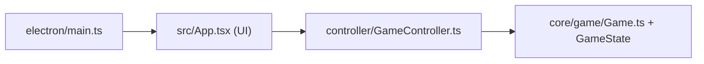
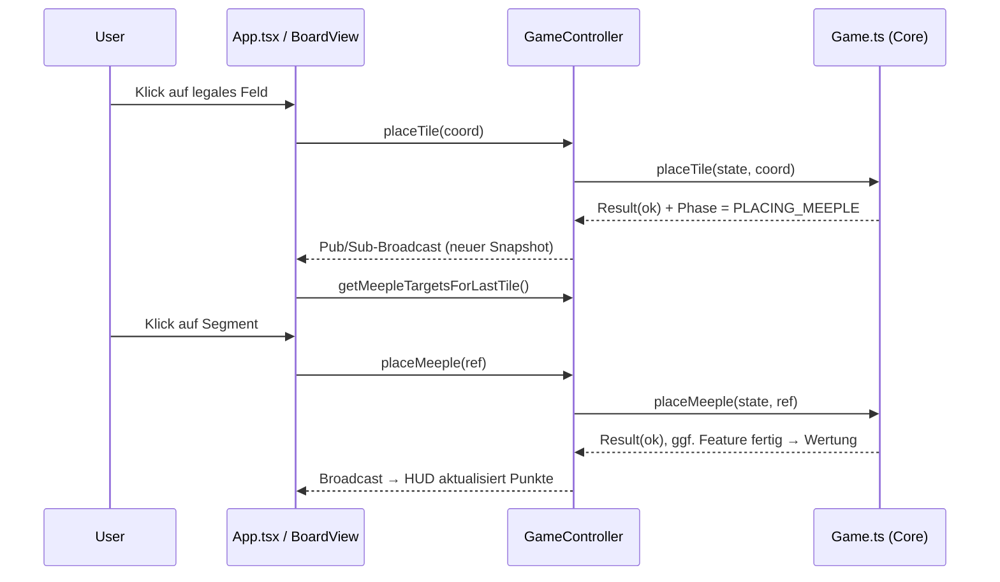

# 08 — Code-Leitfaden

> **Pflichtfrage 3: „Wo steige ich in den Code ein und wie geht es weiter?"**

Dieses Kapitel führt vom Programmstart durch die Codebasis — von der äußersten Schicht
(Electron/UI) bis in den reinen Spielkern — und zeigt für typische Aufgaben, **wo man
weitermacht**.

---

## 1. Mentales Modell zuerst

Vier Schichten, von außen nach innen. **Wer den Code verstehen will, liest von innen
nach außen** (Core → Controller → UI), **wer einem Klick folgen will, von außen nach
innen** (UI → Controller → Core).



---

## 2. Die wichtigsten Einstiegspunkte (Datei-für-Datei)

| Frage | Einstiegsdatei | Was dort passiert |
|-------|----------------|-------------------|
| Wie startet die Desktop-App? | `electron/main.ts` | Erstellt das `BrowserWindow` und lädt die Web-App. |
| Wie startet die Web-/UI-App? | `src/main.tsx` → `src/App.tsx` | React-Einstieg; erzeugt Controller, hält UI-Zustand, rendert Board + HUD. |
| Wie werden Befehle abgesetzt? | `src/controller/GameController.ts` | Synchrone Fassade: `placeTile`, `drawTile`, … + `subscribe`. |
| Wo liegen die Spielregeln? | `src/core/game/Game.ts` | Reine Funktionen, die den `GameState` fortschreiben. |
| Wie sieht der Spielzustand aus? | `src/core/game/GameState.ts` | Zentrale Datenstruktur (Board, Deck, Spieler, Phase …). |
| Wie funktioniert ein KI-Zug? | `src/ai/index.ts` (`executeAITurn`) | Orchestriert Ziehen/Drehen/Platzieren/Meeple je Modus. |
| Wie läuft Netzwerk-Multiplayer? | `server/index.ts` + `server/app.ts` | WebSocket-Broadcast + REST-API. |

> **Empfohlener erster Einstieg:** `src/core/game/Game.ts` lesen (die Spiel-API als reine
> Funktionen), dann `src/controller/GameController.ts` (wie die UI sie aufruft), dann
> `src/App.tsx` (wie alles verdrahtet ist).

---

## 3. Einem Spielzug durch den Code folgen

Beispiel: Ein Mensch legt eine Kachel und setzt einen Meeple.



**Konkret nachvollziehbar:**
1. `BoardView` zeigt legale Felder (über `controller.previewPlacement`).
2. Klick ruft `GameController.placeTile(coord)` auf.
3. Der Controller delegiert an die reine Funktion `placeTile(state, coord)` in
   `core/game/Game.ts`; diese ruft `placeTileInternal` (Board) und löst **Feature-Merging**
   (`core/feature/merge.ts`) und **Completion-Erkennung** (`core/feature/completion.ts`) aus.
4. Wird ein Feature fertig, wertet `core/scoring/midGame.ts` und gibt Meeples zurück.
5. Der Controller veröffentlicht den neuen Snapshot; die via `useGameState` abonnierte UI
   rendert neu.

---

## 4. „Wie geht es weiter?" — Aufgabenorientierte Wegweiser

| Du willst … | Beginne in … | Beachte |
|-------------|--------------|---------|
| **eine neue Kachel / Verteilung ändern** | `src/core/deck/baseGameTiles.ts`, `tiles/tile-*.ts`, `tileDistribution.json` | Datengesteuert — keine Logik anfassen; Unit-Tests in `tests/core/`. |
| **eine Wertungsregel ändern** | `src/core/scoring/` (`midGame`/`endGame`/`farmers`/`majority`) | Tests in `src/core/scoring/*.test.ts` + Szenario-YAML. |
| **Platzierungsregeln anpassen** | `src/core/board/placement.ts` (`canPlace`) | `placement.test.ts` deckt Kantenmatch/Nachbarn ab. |
| **das Feature-Merging verstehen/ändern** | `src/core/feature/merge.ts`, `segments.ts`, `completion.ts` | Union-Find-Semantik; `merge.test.ts`. |
| **eine neue UI-Komponente / HUD** | `src/ui/hud/`, `src/ui/board/` | Nur Präsentation; State immer über Controller-Snapshot. |
| **die KI verbessern** | `src/ai/heuristic.ts` (Greedy) bzw. `src/ai/intelligent.ts` (LLM) | Gemeinsamer Einstieg `ai/index.ts`; MCP-Tools in `server/mcp-ai.ts`. |
| **Netzwerk-Protokoll erweitern** | `server/gameService.ts`, `server/app.ts`, `controller/NetworkController.ts` | Aktionen laufen über denselben Core; nicht duplizieren. |
| **ein neues Regel-Szenario testen** | `tests/scenarios/*.yaml` (+ `tests/scenarios/README.md`) | `npm run test:scenarios`. |
| **3D-Darstellung anpassen** | `src/three/` (Generatoren), `src/ui/board/Board3DView.tsx` | Kacheln werden prozedural aus der Topologie erzeugt. |

---

## 5. Verzeichnis-Landkarte (Kurzreferenz)

```
electron/        App-Lifecycle (Desktop-Fenster)
src/
  main.tsx       React-Einstieg
  App.tsx        Verdrahtung: Controller + UI-Zustand + KI/Netzwerk
  core/          ← REINE SPIELLOGIK (hier liegen die Regeln)
    game/        Game.ts (API), GameState.ts (Datenmodell), Phasen
    board/       Platzierung & Regelvalidierung
    feature/     Gebiete: merge / segments / completion
    scoring/     mid-/end-game / farmers / majority
    deck/, tile/ Kacheldaten & Rotation
    serialize.ts Persistenz
  controller/    GameController (lokal) + NetworkController (online) + pubsub
  ai/            random / heuristic / intelligent + index (executeAITurn)
  three/         3D-Rendering & prozedurale Kacheln
  ui/            React-Komponenten (board, hud, setup, lobby, hooks)
server/          Express-REST + WebSocket + MCP-AI + Persistenz
specs/           technische Spezifikationen (Vertiefung)
tests/, e2e/     Vitest- bzw. Playwright-/Szenario-Tests
tile-lab/        Entwicklungswerkzeug zur Kachel-Visualisierung (QS-05)
```

---

## 6. Konventionen, die man kennen sollte

- **Schichtregel:** `core/` importiert nichts aus `ui/`, `controller/`, `electron/`,
  `ai/`. Verstöße meldet ESLint (`import/no-restricted-paths`).
- **Reine Funktionen:** Core-Operationen geben ein `Result` (`ok`/`err`) zurück und mutieren
  nicht unkontrolliert — gut testbar, leicht serialisierbar.
- **Snapshot statt Direktzugriff:** Die UI liest Zustand **nur** über
  `controller.getState()` / `subscribe()`.
- **Commits:** Conventional Commits (`feat(...)`, `fix(...)`, …) → siehe
  [`specs/10_git-workflow.md`](../specs/10_git-workflow.md).
- **Lokale README-Dateien:** Viele Core-Ordner enthalten eine `README.md` mit Detailwissen
  (`src/core/feature/README.md`, `src/core/scoring/README.md`, …).

---

## 7. Empfohlene Lern-Reihenfolge für neue Mitwirkende

1. **[Kapitel 03 — Architektur](03_architektur-design.md)** lesen (Schichten + Domänenmodell).
2. `src/core/game/GameState.ts` → versteht die zentrale Datenstruktur.
3. `src/core/game/Game.ts` → die Spiel-API (reine Funktionen).
4. `src/controller/GameController.ts` → wie Befehle/Events fließen.
5. `src/App.tsx` + `src/ui/board/BoardView.tsx` → wie die UI rendert/dispatcht.
6. Einen Test ausführen/ändern (`tests/core/...`) → schnelles Feedback.

---

Weiter mit **[Kapitel 09 — Glossar & Anhang](09_glossar-anhang.md)**
