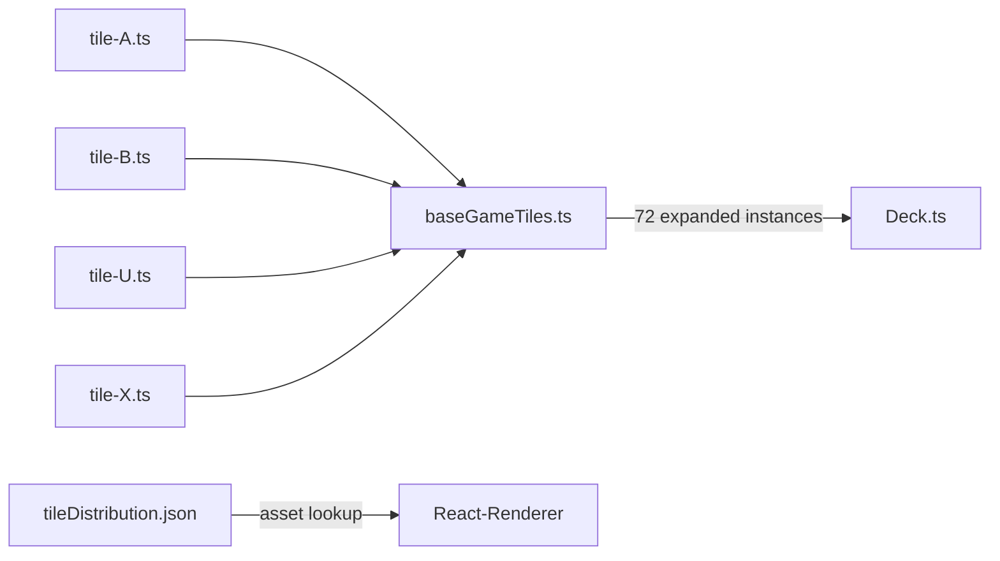

# Tile Prototype File Structure

## Context

The base game has 24 tile types (A–X), totalling 72 land tiles. Each type needs a `TilePrototype` definition (edges + segments) as specified in `specs/03_tile-system.md`.

## Decision

One TypeScript file per tile type, plus a shared types file and a barrel that assembles the deck.

## Structure

```
src/core/
├── types/
│   └── tile.ts              ← TilePrototype, SegmentBlueprint, EdgeSlot, Terrain, ...
└── deck/
    ├── tiles/
    │   ├── tile-A.ts        ← export const TILE_A: TilePrototype
    │   ├── tile-B.ts
    │   ├── ...
    │   └── tile-X.ts
    ├── baseGameTiles.ts     ← imports all 24, builds (prototype, count)[] distribution
    └── tileDistribution.json  ← asset refs + counts for UI lookup (unchanged)
```

## Data Flow



## Rules per tile file

- Exports exactly one named constant `TILE_<Letter>: TilePrototype`
- `id` matches the `id` field in `tileDistribution.json` (e.g. `"TILE-A"`)
- `segments` must partition all 12 edge slots whose terrain is non-FIELD into exactly one segment of matching kind (spec §3.2 constraint 2)
- FIELD segments must reflect the actual connectivity across the tile (critical for farmer scoring)
- `hasMonastery` / `hasShield` match the segment list

## What tileDistribution.json is NOT

It is **not** the game-logic source. It is a UI asset registry. The authoritative tile data is in `src/core/deck/tiles/tile-X.ts`.
