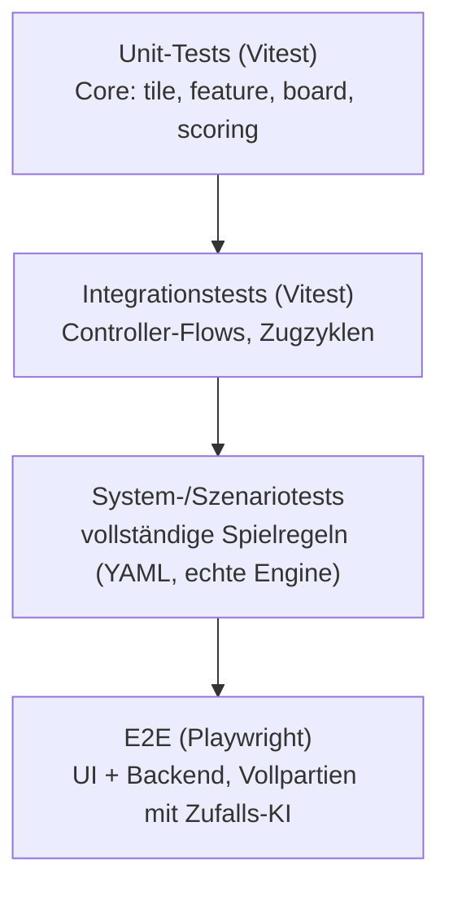
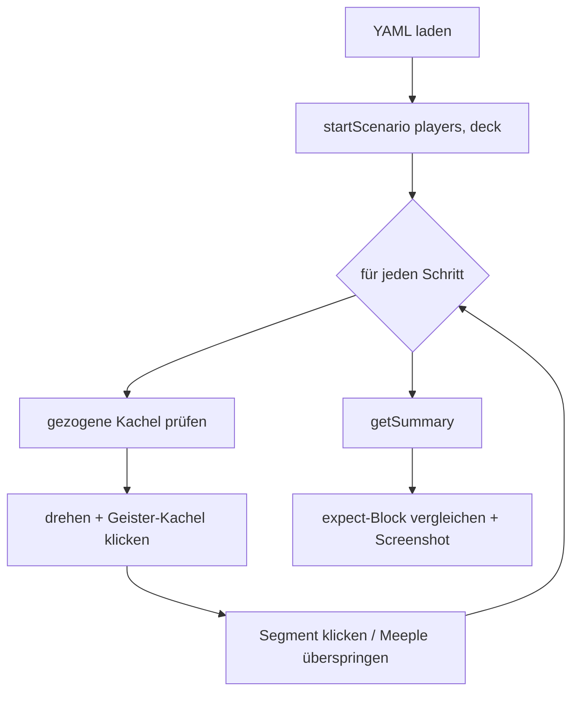

# 06 — Qualitätssicherung

> Teststrategie, Testpyramide, CI/CD und Code-Qualität. QS umfasst **Validierung**
> (Kundenwünsche erfüllt?) und **Verifikation** (Spezifikation korrekt umgesetzt?).

Vertiefung: [`specs/08_testing.md`](../specs/08_testing.md),
`docs/` (Testsystem-Dokumentation).

---

## 1. QS-Konzept im Überblick

| Maßnahme | Art | Im Projekt |
|----------|-----|-----------|
| Strukturierte Programmierung, höhere Sprache | konstruktiv | TypeScript (strict), saubere Schichtung. |
| Daten/Programm getrennt (datengesteuert) | konstruktiv | Kachelverteilung als Daten; keine Hartkodierung. |
| Transparente Dokumentation | konstruktiv | `/specs`, `/docs`, dieses Dokument. |
| Reviews (Tester ≠ Entwickler) | analytisch | Pull-Request-Reviews durch zweite Person. |
| Automatisierte Tests | analytisch | **282 Tests / 40 Dateien** + 11 Szenarien. |
| CI-Gating | analytisch | GitHub Actions blockiert Merges bei roten Tests. |

---

## 2. Teststrategie — vier Ebenen (Testpyramide)



| Ebene | Werkzeug | Scope | Ziel |
|-------|----------|-------|------|
| **Unit** | Vitest | Core-Logik | hohe Anweisungs-/Zweigüberdeckung der Regeln |
| **Integration** | Vitest | Controller, Turn-Zyklen | korrektes Zusammenspiel über die öffentliche API |
| **System/Szenario** | Playwright + YAML | vollständige Regel-Szenarien gegen **echte Engine + 2D-UI** | regelkonforme Wertung end-to-end |
| **E2E** | Playwright | UI + Backend | Stabilität ganzer Partien, User-Flows |

> **Zeitlicher Verlauf E2E (QS-03):** Die Anforderung stammt aus Meeting #1 (04.05.2026);
> implementiert und in CI integriert wurde die E2E-Automatisierung **erst kurz vor
> Meeting #4** (~10.06.2026). Bis dahin erfolgte die Verifikation über Unit-, Integrations-
> und manuelle Tests.

**Strategie-Grundsatz:** *Alle Kernregeln* erhalten Unit-Tests — dort verstecken sich
fast alle Fehler. Die UI erhält bewusst nur **Smoke-Tests** (Aufwand/Nutzen).

---

## 3. YAML-Szenario-Framework (QS-03)

Einzelne Spielregel-Szenarien sind als **YAML** deklariert (`tests/scenarios/*.yaml`) und
laufen in einer echten Chromium-Sitzung gegen die **reale Engine und das 2D-Board** —
ohne KI, ohne gemockten Zustand. Jede Datei ist ein **reproduzierbares** Szenario mit
fester Kachelreihenfolge, DOM-gesteuerten Klicks und Assertions auf eine JSON-Zusammenfassung.



**Beispiel-Szenarien:** Kloster-Fertigstellung (9 Punkte nur mit 8 Nachbarn) · geschlossene
Stadt mit Wappen (`2×(Kacheln+Wappen)`) · geschlossene Straße (1 Punkt/Kachel) · offene
Straße im Endspiel (Meeple bleibt). Aktuell **11 Szenarien** im Repo.

```bash
npm run test:scenarios                          # gesamte Szenario-Suite
npx playwright test -g "monastery-completion"   # einzelnes Szenario
npx playwright show-report                       # HTML-Report
```

---

## 4. Code-Qualität & Metriken (QS-04) — bewusste Entscheidung

Die ursprüngliche Vorgabe forderte formale Code-Metriken (McCabe < 15, Halstead, C0/C1).

> **Entscheidung & Begründung:** Das formale Metrik-Paket **QS-04 wurde verworfen**. Der
> Qualitätsnachweis wird stattdessen über **282 automatisierte Tests, CI-Gating und
> verpflichtende Code-Reviews** geführt. Begründung: aussagekräftige, ausführbare Tests
> sichern Korrektheit und Wartbarkeit unmittelbarer ab als statische Metrik-Reports; die
> Schichtenarchitektur und kleine reine Funktionen halten die zyklomatische Komplexität
> konstruktiv niedrig. Diese Abweichung ist dokumentiert (Notion-Archiv) und wurde im
> Stakeholder-Kontext akzeptiert.

Konstruktiv unterstützt wird niedrige Komplexität durch: kleine reine Funktionen,
ESLint-Linting (`npm run lint`), strikte Typen und die Trennung der Belange.

---

## 5. CI/CD (OPS-01)

GitHub Actions (`.github/workflows/`) automatisiert Tests, Builds und Deployment:

| Workflow | Zweck |
|----------|-------|
| `scenarios.yml` | Szenario-/Testlauf als **Merge-Gate** (PRs nach `develop`). |
| `build-desktop.yml` | Electron-Desktop-Builds (Windows/macOS). |
| `deploy.yml` | Deployment der Web-App auf den VPS (carcassonne.spelk.de). |

**Lokale Vor-Merge-Checks** (sollten grün sein, bevor ein Branch in *Review* geht):

```bash
npm test               # Vitest Unit + Integration
npm run test:e2e       # Playwright E2E
npm run test:scenarios # YAML-Regel-Szenarien
npm run lint           # ESLint
```

---

## 6. Review-Workflow

Jedes Arbeitspaket durchläuft `Offen → In Bearbeitung → Review → Erledigt`. Vor *Erledigt*:

- Code-Review durch eine **andere** Person (Tester ≠ Entwickler, Vorgaben §3),
- alle Tests grün,
- keine neuen Lint-Fehler,
- Akzeptanzkriterien der zugehörigen User Story erfüllt.

---

## 7. Test-Kennzahlen (final)

| Kennzahl | Wert |
|----------|------|
| Testfälle gesamt | **282** |
| Testdateien (Vitest + Playwright) | **40** |
| YAML-Regel-Szenarien | **11** |
| CI-Gate aktiv | ja (`scenarios.yml`) |
| Abdeckung | Unit + Integration + System/Szenario + E2E + KI-Tests |

---

Weiter mit **[Kapitel 07 — Installation & Start](07_installation-start.md)**
