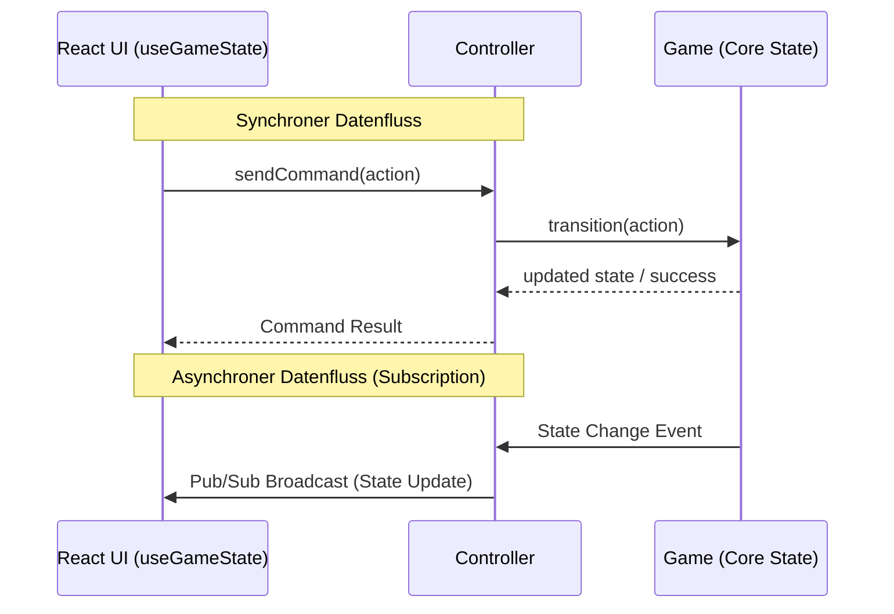

# 1. Architecture

## 1.1 Layered architecture

Four layers, strictly stacked. Each layer may import only from layers below it.

```
┌─────────────────────────────────────────────────┐
│  Electron (main process)                        │  app lifecycle, window, menu
├─────────────────────────────────────────────────┤
│  UI (React + CSS)                               │  rendering, user input
├─────────────────────────────────────────────────┤
│  Controller                                     │  command dispatch + state subscription
├─────────────────────────────────────────────────┤
│  Core (pure TypeScript)                         │  game rules, state, scoring
└─────────────────────────────────────────────────┘
```

**Dependency rules:**

| Layer | May import from | Must NOT import from |
|---|---|---|
| `core/` | nothing app-specific (only stdlib) | `controller/`, `ui/`, `electron/`, React, DOM |
| `controller/` | `core/` | `ui/`, `electron/` |
| `ui/` | `controller/`, `core/` types only | `electron/` directly |
| `electron/` | nothing in `src/` at runtime | — |

Enforcement: TypeScript path aliases + an ESLint `import/no-restricted-paths` rule.

## 1.2 Module map

```
electron/
  main.ts                      ← creates BrowserWindow, loads ui bundle
  preload.ts                   ← (empty / minimal — no IPC needed for MVP)

src/
  core/
    types.ts                   ← shared primitive types (Terrain, EdgeSide, …)
    tile/
      Tile.ts                  ← TilePrototype, PlacedTile types
      rotation.ts              ← rotate slot positions / edges
      prototypes.ts            ← (test fixtures and helpers for tile construction)
    deck/
      Deck.ts                  ← shuffle, draw, hasRemaining
      baseGameTiles.ts         ← canonical 72-tile distribution + start tile
    board/
      Board.ts                 ← Map of placed tiles, neighbor queries
      placement.ts             ← canPlace + placeTile orchestration
    feature/
      Feature.ts               ← Feature record, FeatureRegistry
      segments.ts              ← SegmentRef, segmentToFeature index
      merge.ts                 ← unify two features (union-find semantics)
      completion.ts            ← detect newly-completed features
    scoring/
      midGame.ts               ← score completed cities/roads/monasteries
      endGame.ts               ← score incompletes
      farmers.ts               ← end-game farmer/field scoring
      majority.ts              ← tie-aware majority resolution
    game/
      Game.ts                  ← aggregate, holds GameState
      turnFsm.ts               ← phase transitions
      events.ts                ← event types emitted to controller
  controller/
    GameController.ts          ← wraps Game; commands + subscription
    pubsub.ts                  ← tiny in-process pub/sub
  ui/
    App.tsx
    board/
      BoardView.tsx            ← perspective container; renders all PlacedTiles
      TileView.tsx             ← single tile + meeple rendering
      GhostTile.tsx            ← hover preview
      board.css
    hud/
      PlayerPanel.tsx          ← scores, meeple supply, current player
      TilePreview.tsx          ← drawn tile + rotate buttons
      Controls.tsx             ← skip-meeple, end-turn buttons
      EndGameScreen.tsx
    hooks/
      useGameState.ts          ← subscribes to controller, returns snapshot
      useController.ts         ← provides controller from React context
    styles/
      perspective.css
      tiles.css
  index.tsx                    ← React entry point

tests/
  core/                        ← mirrors src/core; Vitest

vite.config.ts
tsconfig.json
package.json
electron-builder.yml
```

## 1.3 Module responsibilities (in one line each)

- **core/types** — primitive enums and shared aliases (`Terrain`, `EdgeSide`, `SlotPos`, `Rotation`, `PlayerId`, `FeatureId`, `SegmentRef`).
- **core/tile** — define what a tile is, how its edges/segments rotate.
- **core/deck** — own the tile distribution, shuffle, draw, expose `hasRemaining`.
- **core/board** — own the placed-tile grid; answer `getTileAt`, `getNeighbors`, `canPlace`; orchestrate `placeTile`.
- **core/feature** — own all `Feature` records; provide segment→feature lookup; expose `merge`, `getOpenEdges`, `getMeeplesOn`.
- **core/scoring** — pure functions: `(feature) → points`, `(field, allCities) → points`, plus majority resolution.
- **core/game** — top-level aggregate. Owns `GameState`, advances the turn FSM, emits events.
- **controller** — adapts core to UI: synchronous commands return `Result`, exposes `getState`/`subscribe`/`previewPlacement`.
- **ui** — pure presentation: takes the latest `GameState` snapshot, dispatches commands. No game logic.
- **electron** — boots a `BrowserWindow` pointing at the Vite-built UI. No IPC required for MVP.

## 1.4 Tech stack

| Concern | Choice |
|---|---|
| Language | TypeScript (strict mode) |
| Build (UI) | Vite |
| Framework (UI) | React 18 + functional components + hooks |
| Styling | Plain CSS (no preprocessor); `transform` / `perspective` / `box-shadow` for 2.5D |
| Desktop wrapper | Electron + electron-builder |
| Testing | Vitest (unit + integration), React Testing Library (smoke) |
| Lint | ESLint with `import/no-restricted-paths` |

## 1.5 State flow at a glance



UI never reads core state directly except through the controller's snapshot.
