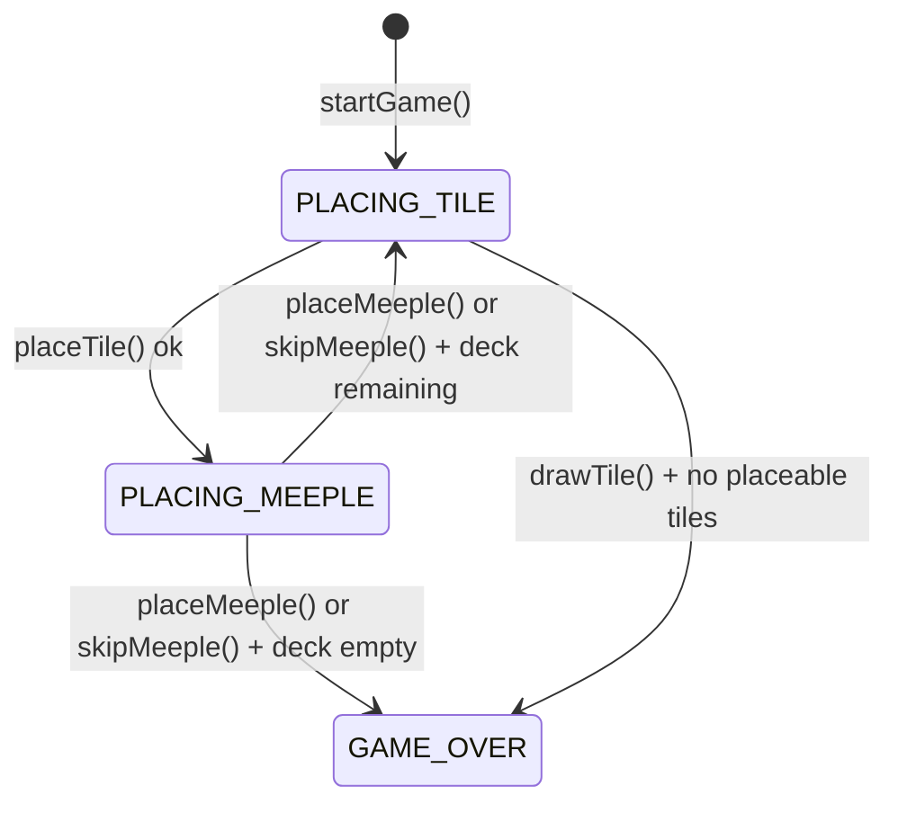

# 9. Meeple System

Meeple placement, legality, state transitions, return mechanics, and UI behavior.

## 9.1 State model

Each player holds `meeplesAvailable: number` (starts at `MEEPLES_PER_PLAYER = 7`).

Meeples live on the **feature**, not the tile:

```ts
// core/feature/Feature.ts
interface MeeplePlacement {
  playerId: PlayerId;
  segmentRef: SegmentRef;   // tileId + localId that was clicked
}

interface Feature {
  meeples: MeeplePlacement[];   // 0 or 1 in a legal game state
  ...
}
```

`GameState` does **not** carry a top-level meeple list — query `board.registry.features`.

## 9.2 Legality (all must hold)

| # | Rule |
|---|------|
| 1 | `state.phase === 'PLACING_MEEPLE'` |
| 2 | `ref.tileId === state.lastPlacedTileId` |
| 3 | `feature.meeples.length === 0` (no meeple on that feature from any player) |
| 4 | `!feature.completed` |
| 5 | `player.meeplesAvailable > 0` |

Error codes on violation: `WRONG_PHASE`, `MEEPLE_NOT_ON_PLACED_TILE`, `MEEPLE_FEATURE_OCCUPIED`, `MEEPLE_FEATURE_COMPLETED`, `NO_MEEPLES_AVAILABLE`.

## 9.3 Turn flow

```
placeTile(coord)
  └─ phase = 'PLACING_MEEPLE'

getMeepleTargets() → SegmentRef[]      ← UI calls this to render targets

player action (exactly one):
  ├─ placeMeeple(ref)
  │     feature.meeples.push({ playerId, segmentRef: ref })
  │     player.meeplesAvailable -= 1
  └─ skipMeeple()   → no meeple state change

_resolveScoring()   ← auto, internal
_advanceTurn()      ← auto, internal
  └─ phase = 'PLACING_TILE'  (or 'GAME_OVER' if deck empty)
```

## 9.4 Meeple return

Triggered inside `_resolveScoring()` for every completed feature:

```
for each f in lastCompletedFeatures:
  { winners, points } = scoreCompletedMidGame(f)
  award points to winners
  for each m in f.meeples:
    player(m.playerId).meeplesAvailable += 1
  f.meeples = []
lastCompletedFeatures = []
```

End-game: meeples are **not** returned (game terminates).

## 9.5 UI behavior

### During `PLACING_MEEPLE`

- `getMeepleTargetsForLastTile()` returns valid `SegmentRef[]`.
- Each ref renders as a **26×26 px circle** on the last-placed tile, positioned at the visual center of its segment (see §9.5a).
- Circle color = `currentPlayer.color` at `cc` opacity, gold border, gold glow.
- `title` attribute shows segment kind (e.g. `"Place meeple on CITY"`).
- Clicking calls `controller.placeMeeple(ref)`.
- "Skip Meeple" button always visible during this phase.
- After placement or skip, targets disappear (phase leaves `PLACING_MEEPLE`).

### §9.5a Segment position algorithm

Meeple targets and placed meeples use **CSS `position: absolute`** with `top`/`left` as percentages — no SVG required.

Each `SegmentInstance` carries `edgeSlots: EdgeSlot[]` (copied from `TilePrototype.segments` at placement time). The visual center is computed by `segmentPosition(kind, edgeSlots, rotation)` in `src/ui/board/segmentPosition.ts`:

1. Map each edge slot to an unrotated (x, y) percentage on the tile:

   | Slot | x% | y% |
   |------|----|----|
   | N/L  | 20 | 10 |
   | N/C  | 50 | 10 |
   | N/R  | 80 | 10 |
   | E/L  | 90 | 20 |
   | E/C  | 90 | 50 |
   | E/R  | 90 | 80 |
   | S/L  | 80 | 90 |
   | S/C  | 50 | 90 |
   | S/R  | 20 | 90 |
   | W/L  | 10 | 80 |
   | W/C  | 10 | 50 |
   | W/R  | 10 | 20 |

2. Average all points → centroid (x̄, ȳ).
3. Rotate centroid around tile center (50, 50) by `tile.rotation` degrees (same direction as CSS `transform: rotate()`).
4. `MONASTERY` or empty `edgeSlots` → fixed center (50, 50).

### Rendered meeples (placed)

`TileView` reads `feature.meeples` via `board.registry` and renders placed meeples as **14×14 px circles** at the segment's visual center (same `segmentPosition()` call as targets).

## 9.6 Test IDs

| Element | `data-testid` |
|---------|---------------|
| Each valid meeple segment target | `meeple-target` |
| Skip meeple button | `skip-meeple-btn` |

## 9.7 State transition diagram



## 9.8 Testable requirements

1. `placeMeeple` on an unoccupied, incomplete feature succeeds and decrements `meeplesAvailable`.
2. `placeMeeple` on an occupied feature returns `MEEPLE_FEATURE_OCCUPIED`.
3. `placeMeeple` on a completed feature returns `MEEPLE_FEATURE_COMPLETED`.
4. `skipMeeple` advances the turn without changing any meeple state.
5. Meeple is returned when the feature completes (mid-game scoring).
6. `getMeepleTargets` returns only segments on the last placed tile.
7. `getMeepleTargets` excludes segments on features that already have a meeple.
8. UI renders one `[data-testid="meeple-target"]` per valid segment during `PLACING_MEEPLE`.
9. Clicking a target advances phase to `PLACING_TILE` (turn ends).
